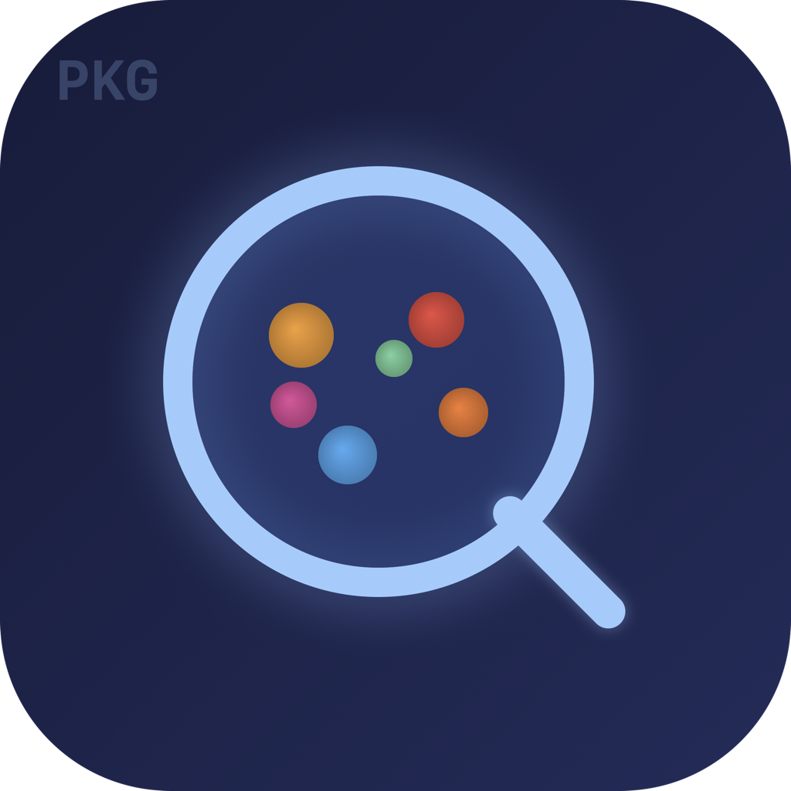
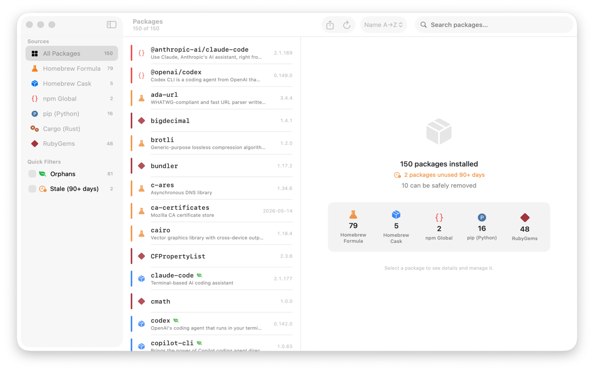
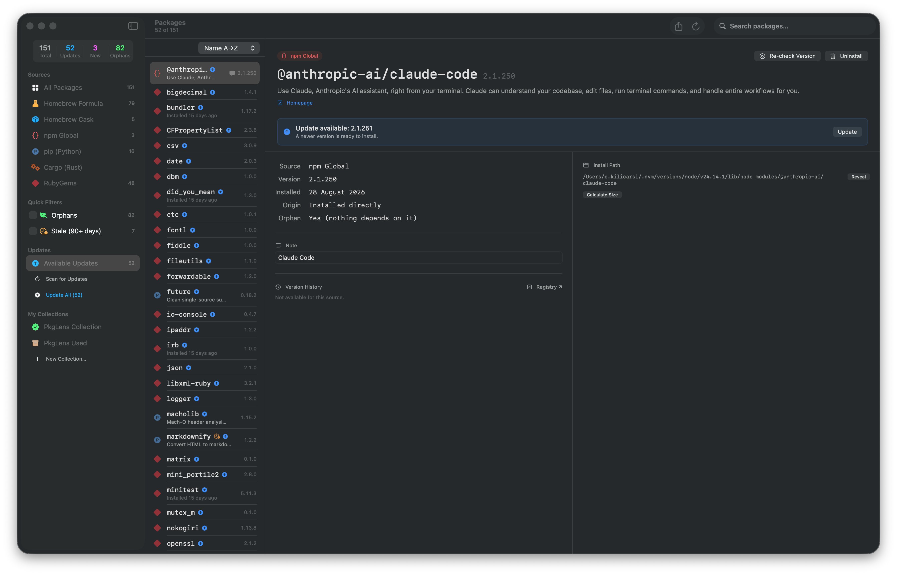
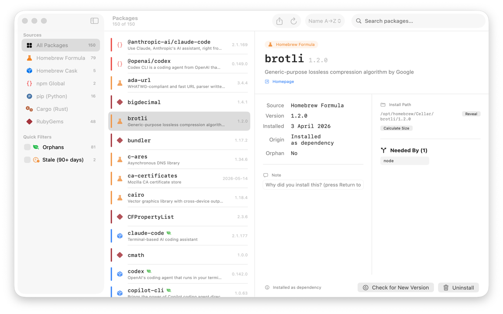

<div align="center">
  
  <h1>PkgLens</h1>
  <p><strong>One place for all your package managers on macOS.</strong></p>

  <p>
    <a href="https://canberk.me/pkglens"></a>
    <a href="https://github.com/canberkys/pkglens/releases/latest"></a>
    
    
    
    
  </p>

  
</div>

---

PkgLens scans **Homebrew** (formula + cask), **npm**, **pip**, **Cargo**, and **RubyGems** — and surfaces everything in a single native macOS window. See what's installed, what's outdated, what's safe to remove, and where each package lives on disk.

No Electron. No web view. Pure SwiftUI.

---

## Features

| | |
|---|---|
| **6 package managers** | Homebrew formula + cask, npm (nvm-aware), pip, Cargo, RubyGems |
| **Dashboard strip** | Live totals — Total, Updates, New (7 days), Orphans — each tile navigates instantly |
| **Per-package version check** | "Check for New Version" button per package; or scan all at once |
| **One-click upgrade** | Update any package directly from the detail panel; "Update All" for bulk upgrades |
| **Changelog & release notes** | Inline version history fetched from GitHub releases or registry APIs — no browser needed |
| **Collections** | Star packages into named groups with custom icons and colors |
| **Orphan detection** | `brew leaves`-based; bulk-remove with one confirmation |
| **Stale packages** | Flags installs untouched for 90+ days |
| **Recently installed** | "New" filter shows packages added in the last 7 days |
| **Install path** | Exact location on disk; Reveal in Finder; lazy size calculation |
| **Reverse deps** | "Needed By" — see which packages depend on this one |
| **Notes** | Per-package notes, stored locally in `~/.pkglens/notes.json` |
| **Uninstall history** | Last 5 removals in the sidebar; full log at `~/.pkglens/history.json` |
| **Export** | Markdown or JSON snapshot of all installed packages |
| **Menu bar** | Live stats; click any number to open the filtered view directly |

---

## Screenshots

<div align="center">
  
  <br><br>
  
</div>

---

## Installation

### Download (recommended)

Grab the latest **PkgLens-1.0.2.dmg** from the [Releases](https://github.com/canberkys/pkglens/releases/latest) page.
Open the DMG, drag PkgLens to Applications.

> **First-launch on macOS 14 / 15**
>
> PkgLens is open-source and not yet notarized through Apple. macOS will show a Gatekeeper warning on the first launch. To open it:
>
> 1. Try to open the app — macOS will say it's blocked.
> 2. Go to **System Settings → Privacy & Security**, scroll down.
> 3. Click **"Open Anyway"** next to PkgLens.
> 4. Confirm in the dialog that appears.
>
> You only need to do this once. Alternatively, run this in Terminal:
> ```bash
> xattr -cr /Applications/PkgLens.app
> ```

### Build from source

```bash
git clone https://github.com/canberkys/pkglens.git
cd pkglens
swift build -c release
open .build/release/PkgLens
```

**Requirements:** macOS 14 Sonoma or later, Swift 6.0+.  
The package managers themselves are all optional — PkgLens skips any that aren't installed.

---

## Usage

| Action | How |
|---|---|
| **Refresh** | ⌘R or the Refresh toolbar button |
| **Filter by source** | Click any row in the Sources sidebar |
| **Orphan / Stale view** | Toggle Quick Filters in the sidebar |
| **Search** | Type in the search bar — matches name and description |
| **Check a package version** | Select it → "Check for New Version" in the bottom action bar |
| **Upgrade a package** | Select it → "Update" banner appears if newer version found (Homebrew + npm) |
| **Uninstall** | Select package → Uninstall button, or right-click any row |
| **Bulk remove orphans** | Enable Orphans filter → "Remove All Orphans" |
| **Add a note** | Detail panel → Note field → press Return |
| **Export** | Toolbar → Export → Markdown or JSON |
| **Help** | Menu bar → Help |

---

## Data stored locally

```
~/.pkglens/
  history.json   # uninstall log
  notes.json     # per-package notes
```

No data is ever sent to a server. No analytics. No telemetry. No phone-home.

---

## Architecture

```
Sources/PkgLens/
  App/            PkgLensApp.swift — entry point, menu bar
  Models/         Package, PackageSource
  Services/       BrewService, NpmService, PipService, CargoService,
                  GemService, HistoryStore, NotesStore, ProcessRunner
  ViewModels/     PackagesViewModel (@MainActor ObservableObject)
  Views/          MainView, PackageListView, PackageDetailView, SettingsView
```

- **Swift 6** strict concurrency — all services are `actor`-isolated
- `ProcessRunner` uses `readabilityHandler` + `DispatchGroup` to avoid the 64 KB pipe-buffer limit on large subprocess output
- SwiftPM only — no Xcode project file required

---

## Contributing

Bug reports and pull requests are welcome. Please open an issue before starting a large change.

---

## License

MIT — see [LICENSE](LICENSE).

<!-- keywords: macos package manager homebrew npm pip cargo rubygems swiftui swift6 developer tools menu bar native app -->
